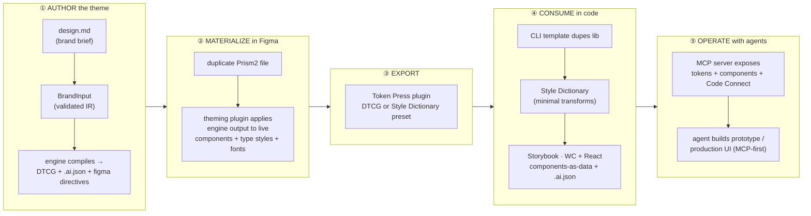
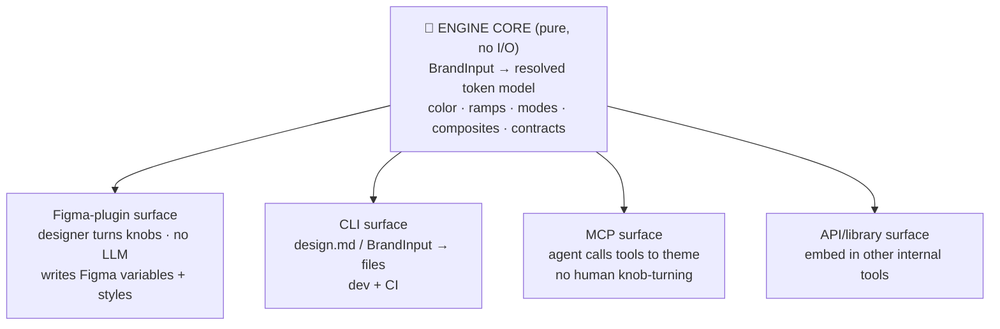

# 07 — The End-to-End Journey (designer ↔ developer ↔ agent)

> Prism3 is not "a token engine" and not "a Figma plugin." It is a **portable theming
> core** with many delivery surfaces, and it is **layer 1 of the four-layer AI stack**
> the practice already commits to (KB file 15). This doc maps the whole journey — from a
> brand brief to production-ready UI — names where each existing tool fits, where the
> engine physically *lives*, and what is built vs. still to build. It is written to be
> lifted out of this repo and worked on with other agents and teammates.
>
> Decision-level forks are called out in **Open decisions**. This is the shared map, not
> a build order; the build order lives at the end.

---

## 1. The organising idea: complete the four-layer AI stack

KB file 15 (*AI in Design Systems*) commits the practice to a **four-layer AI stack** as
the prerequisite for agents producing *system-compliant* UI rather than "AI slop", and to
one sharp claim: **MCP-first beats screenshot-first** — an agent given structured design-system
context writes compliant code; an agent inferring from pixels guesses. A second guardrail:
**AI as critic/composer, not author-from-scratch** — production quality comes from a
deterministic shell + template composition fed by real system context, not freeform generation.

| Layer | What it is | Prism3 status |
|---|---|---|
| 1 — **DTCG tokens + descriptions** | the themed token layer, machine-readable | ✅ the engine emits this today (DTCG + `.ai.json` + Figma directives) |
| 2 — **Component metadata** (`.ai.json` per component) | anatomy, when-to-use, slot contracts | ⬜ future — the code component library |
| 3 — **Agent instructions** (`AGENTS.md`/`CLAUDE.md`) | how an agent should use layers 1–2 | ⬜ future |
| 4 — **MCP exposure / Figma pipeline** | the surface agents actually call | ◑ partial — engine exists; MCP + Figma binding to build |

The whole E2E vision reduces to one sentence: **Prism3 built layer 1; the journey is to
complete layers 2–4 so an agent can operate the pipeline end-to-end — without forcing a
human (or an LLM) into any single step.**

---

## 2. The pipeline



Each stage is backed by a POV the practice has already written down:

| Stage | What happens | Committed KB POV that backs it |
|---|---|---|
| ① Author | brief → tokens; 5–10 inputs derive the whole semantic layer | **Generative Token pattern** (§24): core primitives + computation, ~10% cost for the Nth brand |
| ② Materialize | duplicate the Figma file, plugin themes it in place | **Managed inheritance** + **materialization directive** (§22/24) |
| ③ Export | Token Press → DTCG / Style Dictionary preset | **DTCG as interchange, not architecture**; **compute-at-authoring, ship literals** (§22) |
| ④ Consume | one source → WC **and** React **and** Storybook | **Components-as-data** (§03/30): YAML/JSON is source, frameworks are outputs |
| ⑤ Operate | agents build with real system context | **Four-layer stack** + **MCP-first > screenshot-first** (§15) |

Two things this map deliberately **excludes**: (a) tokens-live-in-a-repo-and-are-pushed-back-into-Figma
(code→Figma round-trip) — not a workflow we want; Figma is themed in place by the plugin.
(b) any requirement that a human turn every knob, or that an LLM be present — see §4.

---

## 3. Where the engine physically lives — **portable core, many surfaces**

This is the central architectural answer. The engine is **not** a plugin and **not** a CLI.
It is a **pure, dependency-free core** that is bundled into whichever surface needs it.

**Evidence it's portable today.** The theming brain — `color.ts`, `ramp.ts`, `scale.ts`,
`modes.ts`, and the `build*` functions in `theme.ts` — is pure computation with no Node
dependencies. Only two things touch `node:fs`: the **emit layer** (writing DTCG/HTML files)
and **two NB-regression fixture loaders**. Neither is on the theming path. So making the
core runnable inside a browser/Figma-plugin sandbox is a **bounded refactor** (split pure
core from I/O shell), not a rewrite.



The point: **the same brain runs in all of them.** This dissolves the "the plugin doesn't
have all the engine's options" problem — the plugin *is* the engine, wearing a Figma face.

### The design principle to hold from here on
**Pure core / I/O shell separation.** No file reads, no `node:*`, no environment
assumptions inside the theming core. Every surface (plugin, CLI, MCP, API) is a thin
adapter that feeds the core an input and does something with the output. Keep the NB
regression's fixture-loading in the CLI shell, not in `theme.ts`.

---

## 4. Multiple entry points — and the "no forced LLM" guarantee

You do not want to force everyone through an LLM to theme. The portable core makes that
free: the *input* to the core can arrive three ways, and they coexist.

| Entry point | Who/what drives it | LLM required? | Fits stage |
|---|---|---|---|
| **Figma plugin knobs** | a designer, turning dials | ❌ no | ② Materialize (and can author too) |
| **`design.md` / `BrandInput` file** | a dev writing it by hand, **or** an agent drafting it | optional | ① Author |
| **MCP tool calls** | an agent theming without a human | ✅ yes (that's the point) | ⑤ Operate |

The knob-turning designer and the autonomous agent hit the **same core** and get the
**same option set** — no second-class path. The LLM is one *optional* driver of the input,
never a gate on the system.

---

## 5. The engine ↔ theming-plugin convergence: **one brain, two materialization targets**

Today the engine and the existing Figma plugin are two separate brains: the engine has
options the plugin lacks; the plugin can touch live components, type styles, and
Figma-loaded fonts the engine can't. The resolution is **not** to port the engine's logic
into the plugin (that rebuilds the brain twice and re-creates drift — the exact failure the
KB round-trip note calls out, where hand-reassembled Figma styles drift from the tokens).

Instead: **the engine core becomes the plugin's brain (§3), and the plugin is the
*materialization adapter* for the Figma target.** The engine already stamps every leaf with
`$extensions.prism3.figma` + a `variableId` linkage — precisely the contract needed to apply
engine output onto the duplicated file's existing variables.

This dissolves the three current plugin pain points:

| Plugin pain point today | Resolved by |
|---|---|
| Plugin lacks the engine's richer options | It *is* the engine core → inherits every option automatically |
| Namespace change breaks the plugin | Namespace is already an engine parameter (`id → prism.*`); it becomes a declared contract the plugin honors, not a hardcoded assumption |
| Custom font weights vary by font **and** spelling (*Semi Bold* vs *Semibold*) | **Declare once** in `design.md`/`BrandInput` (`weightRoles` → the font's named instances); the engine emits the mapping; the plugin *resolves* the exact Figma style using its loaded-font list. Declared once, consumed in both Figma and code. |

The plugin's ability to read Figma-loaded fonts stays a **strength** — it becomes the
*resolver* for an engine-declared intent, not an independent source of truth.

---

## 6. `design.md` — the authoring front door (new practice IP)

> **✅ BUILT (2026-07-01).** `engine/design-md.ts` (block-style YAML-subset parser
> → `BrandInput` + prose split) + `engine/cli.ts` (`tsx cli.ts <design.md> [--out]`)
> over the pure core; `emit-dtcg.ts` now exports the reusable core and compiles the
> two example briefs from `examples/*.design.md`. `aurora.design.md` reproduces the
> golden byte-for-byte (faithfulness); `harbor.design.md` is the net-new coverage
> brand (schema-conforms, aliases resolve, 248/248 contrasts hold). Wired into
> `test.ts` (189/189). See `00-progress.md`. The build shape below is the as-built
> record.

The KB has **no committed POV** on "a design brief as a file that drives generation" (closest:
§30 "component data file is source", §04 "voice-and-tone matrix as a system prompt"). So this
is greenfield and worth a KB write-up + targeted research once proven — it would be defensible IP.

`design.md` sits **one level above `BrandInput`**: it is the human- *and* agent-authorable
source; `BrandInput` stays the validated intermediate representation the engine compiles.

```markdown
---
# structured frontmatter → compiles 1:1 to BrandInput (the engine reads this deterministically)
id: aurora
primary: { l: 0.55, c: 0.18, h: 265 }
neutral: { hue: 265, chroma: 0.008 }
typography: { families: { display: "Clash Display" }, weights: { emphasis: 500 } }
motionPersonality: { tempo: snappy }
---
# Aurora — brand brief

Energetic, premium, confident. Hero moments should feel expansive; UI should feel calm and
precise. (Prose an *agent* reads to make judgment calls the frontmatter can't encode —
"energetic" → tempo: snappy; "premium restraint" → tighter tracking.)
```

The split is the whole idea: **frontmatter is the deterministic contract the engine
compiles; prose is the latitude an agent reads.** An agent drafting `design.md` from a real
brand brief becomes the natural on-ramp at the authoring end — "agents operate the whole
thing" starting from the very first step, while a human can still write or edit the same file.

**Locked build decision (2026-07-01): YAML frontmatter + a hand-rolled parser.**
`design.md` uses **YAML frontmatter** (nicest for a human *and* an agent to author). Because
the engine is dependency-free (no npm install) and Node ships no YAML parser, the CLI owns a
**minimal YAML-subset parser** (~30 lines) scoped to the `BrandInput` shape — in the same
spirit as owning the colour math rather than pulling a library. The parsed frontmatter is
validated against `schema/theme-schema.json` (the existing `BrandInput` contract) before the
core builds the theme. MVP consumes the frontmatter only; the prose is agent/human input, not
yet parsed. (Alternatives considered and rejected: JSON frontmatter — uglier to author;
`design.json` + prose companion — two files.)

**Build shape for step A (the CLI adapter):**
- `engine/design-md.ts` — the YAML-subset parser + `parseDesignMd(text) → BrandInput`.
- `engine/cli.ts` — `tsx cli.ts <design.md> [--out <dir>]`: parse → schema-validate → `brandTheme(input)` (the pure core) → reuse the existing emit (`emit-dtcg`) + `ai-metadata` + optional `visualize`. No new token logic; it's a new *entry point* over the core, replacing the hardcoded `nb`/`aurora` themes with a file-driven one.
- A worked `examples/aurora.design.md` whose frontmatter reproduces the current `aurora` `BrandInput`, so the CLI output can be diffed against `out/aurora.tokens.json` as the acceptance test (the **faithfulness** check — CLI path ≡ hardcoded path, byte-for-byte).
- A **second, net-new brand** authored from scratch through the CLI (the **coverage** check — the engine has never seen it via this path). It should deliberately exercise the *complementary* corner of the input space from Aurora, so between the two the levers are well covered:

| lever | Aurora (existing) | second brand (new) |
|---|---|---|
| action source | `accent` (decoupled from brand) | **default** (`action = primary`) |
| brandColors[] | present (accent) | **minimal / none** (bare-input path) |
| surfaces | white/black defaults | **warm off-white surface override** (moves the contrast floor) |
| status | synthesised | **measured status overrides** |
| form factor | compact / soft (radius 2) | **comfortable / sharp (radius 1)** |
| type | expressive scale, variable display face | **compact/standard scale, system stack** |
| gradients | on (linear + radial) | **off** (the field-default abstain) |

  A concrete candidate: **"Harbor"** — a restrained deep-teal primary, `action = primary`, a warm off-white page, gradients off, comfortable density. (Name/values final at build.) Since there's no golden file, its acceptance test is **behavioural, not byte-exact**: it runs, schema-conforms, every alias resolves, and all 248 contrast contracts hold. Wire both examples into the test run so the two together are a regression on the CLI path.

---

## 7. Downstream: the component library, components-as-data, and Code Connect

In scope **eventually**, mapped **now** so upstream choices don't foreclose it. The vault
already carries heavy per-component research (the UIC series, §03) — the intent is that this
research lets the Figma library and the code library be built **1:1** and fast.

- **Components-as-data (§03/30) is the answer to the WC + React problem.** One YAML/JSON
  definition per component is the *source*; the Web Components build, the React build, the
  Storybook stories, the `.ai.json`, and the Figma component set are all *outputs*. This is
  what keeps a multi-framework library from drifting — and it *is* layers 2–3 of the stack.
- **`.ai.json` per component** (component_id, primary_purpose, when_to_use, avoid_when, slot
  contracts, a11y metadata) is what turns an MCP-first agent from "plausible" to
  "system-compliant." It mirrors, at the component tier, exactly what the engine already
  does for tokens.
- **Figma Code Connect** is the binding that keeps Figma components ↔ code components
  connected, and it is what an MCP-first agent reads to emit the *right* component code. The
  KB names Code Connect as an emerging default deliverable (§05/15). It slots into ⑤ Operate
  and should be planned as part of the component-library workstream, not bolted on later.

Mapped shape (future): `component.yaml` → { WC, React, Storybook (both), `.ai.json`, Figma set,
Code Connect map }. Same "compute/define at authoring, generate the surfaces" philosophy as
the token engine.

---

## 8. Open decisions

1. **Engine-core extraction.** Confirm the pure-core / I/O-shell split (§3) as the next
   structural move — it's the precondition for the engine living inside the plugin and behind
   an MCP. Bounded refactor; unblocks everything downstream.
2. **First adapter to build.** `design.md` + CLI (small, proves the authoring on-ramp, gives
   agents a front door) vs. the MCP server (bigger, but the headline "agents build production
   UI" payoff) vs. folding the core into the Figma plugin first (designer value soonest).
3. **Plugin ownership.** Is the Prism3 Figma plugin a rebuild around the engine core, or an
   evolution of the existing theming plugin? (§5 says same brain either way; this is about
   effort and continuity.)
4. **Component library boundary.** One system with the token engine, or a sibling that meets
   it at Style Dictionary? Affects whether components-as-data + `.ai.json` are generated by
   the same tooling.
5. **Where `design.md` and the plugin-convergence pattern get validated** — both are new
   IP; each wants a targeted research pass + a KB note before it hardens.

---

## 9. Suggested sequence (not a commitment)

1. **Extract the pure core** (I/O-shell split). Precondition; small. ✅ done.
2. **`design.md` + CLI adapter.** Authoring on-ramp; proves the front door; no LLM required
   to use it, agent-draftable when wanted. ✅ done (2026-07-01) — see §6.
3. **MCP adapter over the core.** Turns "agent themes Prism3" from aspiration to a callable
   surface — the §15 MCP-first payoff.
4. **Fold the core into the Prism3 Figma plugin** as the Figma materialization adapter
   (§5); retire the plugin's separate brain.
5. **(Later) Component library** as components-as-data → WC + React + Storybook + `.ai.json`
   + Code Connect (layers 2–3), reusing the UIC research in the KB.

---

## 10. KB grounding (so this doc doesn't freelance)

| Claim here | KB source |
|---|---|
| Four-layer AI stack; MCP-first > screenshot-first; AI as critic not author | §15 *AI in Design Systems* |
| Compute-at-authoring, ship literals; DTCG as interchange; materialization directive | §22 *Token Architecture Extensions* |
| Components-as-data; UIC per-component research; headless vs. opinionated | §03 *Component Library*, §30 *Generated-From-Data Documentation* |
| Generative Token pattern; managed inheritance; brand version pinning | §24 *Tokens at Scale* |
| Embedded handoff; token pipeline; Code Connect as emerging default | §05 *Development Support* |

**New IP not yet in the vault (research + write-up candidates):** `design.md` as a
generation-driving brief; the "engine core as portable brain, plugin as materialization
adapter" convergence; declaring font-weight/named-instance mapping once and resolving it in Figma.

---

## 11. Integration contract — `design.md` as the interchange language (2026-07-01)

The owner (Adam) built several of the pipeline tools already; we own all of them, so the
job is to make them **understand each other** through one shared contract rather than a pile
of converters. Locked decisions in this section.

### 11.1 The tools we own, and each one's role

| Tool | Stage | Role | Status |
|---|---|---|---|
| **brand-skills** (CLI + Claude skill) | ① Author | **EXTRACT** — assets (Figma/site/PDF) → a `design.md` + `.brand/` package (observed colours/type/space + rich brand prose) | exists; public repo |
| **Prism3 engine** | ① Author | **GENERATE** — `design.md` anchors → a complete, contract-verified, moded token system | this repo |
| **Token Press** (Figma plugin) | ③ Export | Figma → Style Dictionary / DTCG export | exists; **private, different org** — not provisioned here yet |
| **Theming plugin** (Figma) | ② Materialize | themes a duplicated Figma file (variables) | exists; **separate** project |
| **Text-style plugin** (Figma) | ② Materialize | updates variable bindings in text styles | exists; **separate** project |
| **Style-guide generator** (Figma) | ②/view | generates a style guide inside Figma | exists; **separate** project |
| **CLI templating system** | ④ Consume | dupes the code component library, drops tokens/fonts, runs SD → Storybook | exists |

The three Figma plugins are confirmed **separate** codebases → the consolidation target (§5 /
§11.5) is real, not hypothetical.

### 11.2 `design.md` is the interchange contract — follow the spec, don't fork it

**Decision:** the single interchange format across the whole system is
**[`google-labs-code/design.md`](https://github.com/google-labs-code/design.md)** (an open
standard). `brand-skills` already emits it; the engine will **consume** it. We stay
spec-conformant so the pipeline is portable, not bespoke. Verified against a real extraction
(a Wendy's `design.md`): the base spec carries `colors` / `typography` / `rounded` / `spacing`
/ `elevation` as resolved values + `##` prose.

### 11.3 One generator (and why `brand-skills` still stands alone)

**Decision A:** the engine **regenerates from anchors + emits a fidelity report** — it reads
the anchor-level values (primary, neutral hue, brand + status colours, families), generates
its *complete* verified system (light/dark/HC modes, contrast contracts, `on-*` pairs,
gradients, motion — everything extraction can't produce), pins the exact brand anchor, and
reports where its generated ramp diverges from the provided values (the NB-regression pattern —
nothing changes silently).

**The "one generator" principle does NOT strip `brand-skills`.** It stays a *complete
descriptive extractor* — it emits the full observed snapshot (ramps, scales, type roles), so a
user who runs `brand-skills` **without** going on to the engine still gets a usable colour
system. The distinction is provenance, not completeness: `brand-skills` values are *observed*
(descriptive); the engine's are *generated + contrast-verified*. The engine simply does not
treat `brand-skills`' ramps as the final system — it regenerates and reports. (This is the
answer to "will a brand-skills-only user get the colours they need?" — **yes**.)

### 11.4 Staying spec-true while the engine needs more levers

The base `design.md` stays **pure spec**. The engine's extra generative knobs that the base
spec has no home for (motion tempo, density, action-decoupling, icon-contrast, gradients,
surface overrides) are handled two ways, both additive:
- **sensible defaults** — a plain spec file compiles with zero extra keys; and
- an **optional, namespaced `x-prism3:` extension block** the base spec ignores, for full
  control when a human/agent wants it.

So a `brand-skills` file works untouched; power users opt into `x-prism3:`. Spec-true, not
spec-limited. **(Decision: approved.)**

### 11.5 The "understand each other" layer — naming conventions

Two shared vocabularies make the bridge deterministic (no guessing in the classifier):
- **Colour-role names** — `primary`, `secondary`, `tertiary`, `neutral-<step>`,
  `success` / `warning` / `error` / `info`. The engine's **colour-role classifier** reads the
  flat `colors:` map into anchors using these conventions (the one genuinely new parser piece).
- **Type-role vocabulary** — **align `brand-skills` to the engine's semantic roles**
  (`display` / `title` / `body` / `label` / `caption` / `eyebrow` / `code`), i.e. one vocabulary
  across the system. `brand-skills` currently emits `mega` / `display` / `title` / `body` /
  `caption` / `button`; it moves to the engine's set (`mega`→top of `display`; `button`→`label`).
  **(Decision: align, not map.)**

### 11.6 Next step — the Wendy's spike (validation before rework)

Before reworking step A's format, build a spike **here** (prism3-tokens): a standard-`design.md`
reader + the colour-role classifier, run the real Wendy's `design.md` through the engine →
a full Wendy's token system **+ a fidelity report** vs its provided values. Evidence-first: the
spike tells us exactly what the contract and the `brand-skills` changes should be. It does not
touch the shipped step-A pipeline.

### 11.7 The `brand-skills` alignment spec (for the brand-skills-provisioned thread)

`brand-skills` can't be edited from a session scoped to prism3-tokens + knowledge-base (its git
is proxy-blocked, 403). The owner will open a **new thread with prism3 + knowledge-base +
brand-skills provisioned** to do that work. Deliverable from *this* side: an **alignment spec**
(derived from the spike) listing what `brand-skills` should change — type-role rename, the
colour-role naming contract, the optional `x-prism3:` block — so both tools speak the same
contract. **Token Press** provisioning is deferred (it's a private, different-org repo and sits
at the *export* stage, downstream of this work); its I/O is captured in §11.1 so the contract
accounts for it without needing its code yet.
